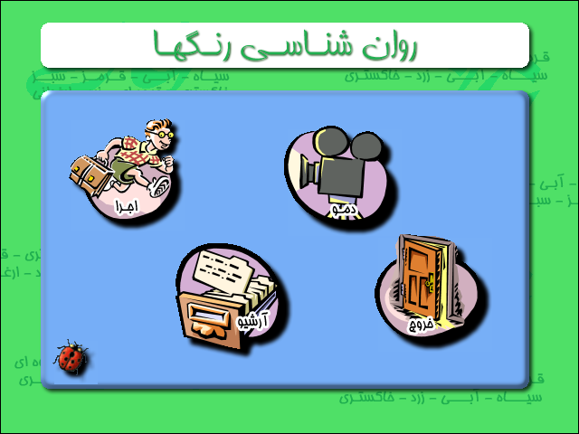
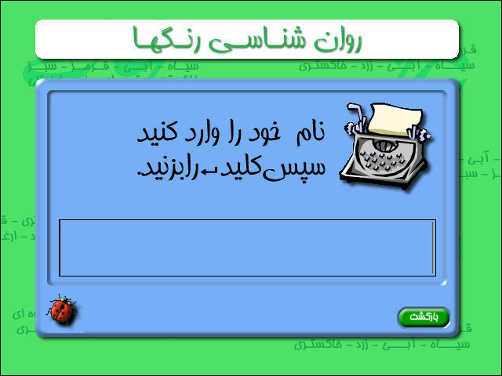
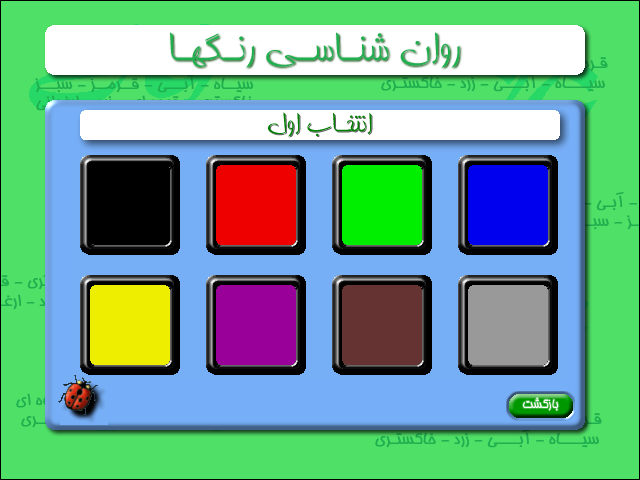
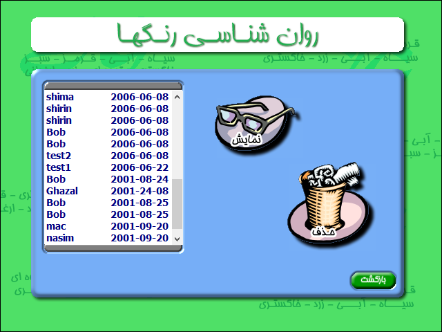

# WinColors 
A Color psychology for windows based on __Max LÜSCHER__'s __The LÜSCHER Color Test__

Many years ago I discovered a Chinese application on a CD. The program wasn't working maybe due to scratches on CD.
I was curious to see what is it, by instinct I dig up into its resources and immediately get excited by seeing bitmap, wav sounds, font and text. Not because I found a treasure, but an Idea and that was if they can do it, I can do it too. I decided to make a program and use the idea in it. The first program that came to my mind was a FoxPro app that I had for many years before that but it only worked on MS DOS 6.2. The program was based on a Persian book which was based on LÜSCHER's color test. 

### Converting that app was a challenge.

- The original FoxPro app was using a nonstandard ASCII font to show to show Persian alphabet.
- Wrote a parser to re-encode those characters to Windows-1256 character set.
- Then I realized since spacing was embedded in the font itself, there is no word spacing in the original text, meaning all characters are attached together (those who know Persian language know what I mean), I had to separate words manually
- Next using Photoshop I tried to make an interface for my application and then cut interactive pieces from it.
- Used some of the clipart's provided with word 2000 for buttons and made 3 state buttons out of them (pushed, mouse over and normal) 
- Next was writing the program, handling user inputs, calculating the mouse clicks and so on.
- Program was ready in less than a month.

And then came disaster, Upgraded my windows to XP and Delphi 1 wouldn't run anymore and neither my program (both were 16 bits). 
That was 2001 and I totally forgot about it. In 2006 and I gave it another go, a few touch up here and there and few changes later, program was running again and could be used.
I made the program for hobby but used the knowledge I made out of it, in many professional programs that I made for other companies.

Few months ago I found the program in my massive backup folder of old codes and tried to run it again, it was running but every test in it was showing gibberish.
Well it was a modified Windows-1256 implementation to cater for Persian alphabet (ordering, code points ...).
Time to touch up again. Only changes made were changing code page to UTF-8 and modify interface to show correctly on High DPI screens. Here is the source code for the whole thing (except the data of course). Oh! Forget to mention, this is a 64bit application now and will not run on 32 bit machines.

## Notes:
- Even though the released application does work, I had to remove some data due to copyright for 2 books and original application that are still valid.
- The text shown in the application is just summary of the original text (20% of original report)
- Even though this app might give you good insight in your state of mind, but it is definitely not meant to be used as a psychological assessment tool and it is just meant to be used as party entertainment.

## How to use
- Run the app (obviously).

- Click on run button (the running man)

- Enter a name at least 3 character and press enter

- Select the colors in order of preference 
- Once all colors selected, screen will refresh and show the colors again. Select colors in order of preference again but do not try too hard to select them exactly the same way as before.
- Result will be shown after completion.

- To see the hints and how it works and how to use it, click on `ladybug` (isn't she cute?)
- A list of previous runs will be stored in file, to see them, click on archive button

